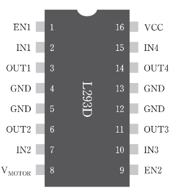
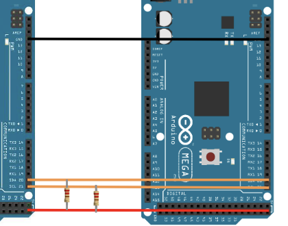

# $\text{Adventure Design Final Summary}$

---

## 스피커; OUTPUT


- PWM 신호를 사용하여 단음 재생
- 50% duty cycle
  - duty cycle : PWM 신호에서 high level이 차지하는 비율

```ino
tone(핀, 주파수, /*지속시간*/); // AnalogWrite()는 주파수 조절 불가
delay(지속시간);
noTone(핀);
```

[`pitches.h`](https://github.com/codebendercc/arduino-library-files/blob/master/examples/02.Digital/toneMelody/pitches.h) : 주파수를 정의한 헤더 파일

- 용례: `NOTE_C4` `NOTE_ES5`

---

## 온도 센서; INPUT


- `analogRead(핀)` : 0~1023
- $\rightarrow$ $V$: `map(analogRead(핀), 0, 1023, 0, 5);`
- $\rightarrow$ $\degree C$: `map(analogRead(핀), 0, 1023, 0, 500);`
- $\rightarrow$ $\degree F$: `map(analogRead(핀), 0, 1023, 32, 932);`
  - $\degree F = \dfrac{9}{5}\degree C + 32$

---

## 조도 센서; INPUT


### CdS(황화 카드뮴) 셀

- $광량 \propto \dfrac{1}{저항}$
- 저렴하고 간단
- 느리고 부정확

## 7세그먼트; OUTPUT


- Anode: 위아래 VCC, LOW에 ON
- Cathode: 위아래 GND, HIGH에 ON
- 0babcdefg. 시계방향, 가운데 순서

### 4자리 7세그먼트


- 주황색: 자릿수 선택 핀
- 파란색: 세그먼트 선택 핀

- 잔상 효과로 12개의 핀을 사용(원래는 10개)

```ino
// 숫자 0~9
byte patterns[] = {
  0xFC, 0x60, 0xDA, 0xF2, 0x66, // 0, 1, 2, 3, 4
  0xB6, 0xBE, 0xE4, 0xFE, 0xE6, // 5, 6, 7, 8, 9
}
// 자릿수 선택 핀
int digit_select_pin[] = {66, 67, 68, 69};
// 세그먼트 선택 핀
in segment_pin[] = {58, 59, 60, 61, 62, 63, 64, 65};

// 한 자릿수 표시
void show_digit(int pos, int number) {
  // 자릿수 선택
  for (int i = 0; i < 4; i++) {
    digitalWrite(digit_select_pin[i], !(i == pos));
  }
  // 세그먼트 선택
  for (int i = 0; i < 8; i++) {
    digitalWrite(segment_pin[i], bitRead(patterns[number], 7 - i));
  }
}

// 4자리 표시
void show_4_digit(int number) {
  int digit[4];
  for (int i = 0; i < 4; i++) {
    digit[i] = number % 10;
    number /= 10;
  }
  for (int i = 0; i < 4; i++) {
    show_digit(i, digit[i]);
    delay(5);
  }
}
```

- `millis()`를 이용해야 함
  - `delay()`를 사용하면 잔상 효과를 얻지 못함

---

## LCD; OUTPUT


- 저전력

`LiquidCrystal.h` 라이브러리 사용

```ino
#include <LiquidCrystal.h>

LiquidCrystal lcd(핀1, 핀2, 핀3, 핀4, 핀5, 핀6);

// 커스텀 문자(5×8)
byte customCh[] = {
  B00000,
  B00000,
  B00000,
  B00000,
  B00000,
  B00000,
  B00000,
  B00000
};

lcd.createChar(커스텀 문자 번호, customCh);
lcd.write(byte(커스텀 문자 번호));

void setup() {
  lcd.begin(열개수, 행개수);
}

lcd.write('문자');
lcd.print("문자열");
lcd.setCursor(열(0~15), 행(0~1));
lcd.clear();
```

### 구조


- 패널 + 컨트롤러 = 모듈
- 데이터 버스를 통해 컨트롤러에 명령 전달 $\rightarrow$ 컨트롤러가 패널에 명령 전달
- DDRAM: 텍스트 표시 영역
- CGRAM: 커스텀 문자 저장 영역
- CGROM: 기본 문자 저장 영역
- 컨트롤러: 컨트롤러
- Power 회로: 전원 회로

## 서보 모터; OUTPUT


- 50Hz PWM 신호: 20ms 주기
  - 1ms(5%) ~ 2ms(10%) duty cycle

`Servo.h` 라이브러리 사용

```ino
#include <Servo.h>

Servo servo;

// setup()
servo.attach(핀);

// loop()
servo.write(각도);
```

- 최대 제어 가능 서보모터 수
  - Arduino Uno: 12개
  - Arduino Mega: 48개

## DC 모터; OUTPUT

- 최초의 모터
- VCC, GND 두 개 만으로 전류 방향을 바꿔서 회전 방향을 바꿈
- PWM 신호를 사용하여 속도 제어
- 문제점
  - 결선 후 회전 방향을 바꿀 수 없음
    - H-bridge 회로를 사용하여 해결
      
  - 전력돼지새끼
  - 전용 드라이버가 필요함
    - L293D 모터 드라이버 칩

### L293D 모터 드라이버 칩



| L293D 핀(왼쪽↓) | L293D 핀(오른쪽↑) | 모터 핀     |
| --------------- | ----------------- | ----------- |
| EN1             | EN2               | 모터 활성화 |
| IN1             | IN3               | 속도 제어   |
| OUT1            | OUT3              | 모터 연결   |
| GND, GND        | GND, GND          | GND         |
| OUT2            | OUT4              | 모터 연결   |
| IN2             | IN4               | 방향 제어   |
| V~MOTOR~        |                   | 모터 전원   |
|                 | VCC               | 칩 전원     |


```ino
const int ENABLE = 38;
const int PWM = 9;
const int DIR = 39;

void setup() {
  pinMode(ENABLE, OUTPUT);
  pinMode(PWM, OUTPUT);
  pinMode(DIR, OUTPUT);

  digitalWrite(ENABLE, HIGH);
}

void loop() {
  digitalWrite(DIR, HIGH);
  analogWrite(PWM, 255); // -255 ~ 255
  delay(1000);
}
```

## 스텝 모터; OUTPUT

하나의 펄스가 주어지면 분할각 단위로 회전

## 시리얼 통신

|               | UART               | SPI         | I2C          |
| ------------- | ------------------ | ----------- | ------------ |
| 동기 방식     | Async              | Sync        | Sync         |
| 전송 방식     | 전이중             | 전이중      | 반이중       |
| 전송 방향     | 1:1                | 1:n         | 1:n          |
| 슬레이브 선택 | `SoftwareSerial.h` | HW(`SPI.h`) | SW(`Wire.h`) |
| 데이터 연결선 | 2                  | 2           | 1            |
| 클럭 연결선   | X                  | 1           | 1            |
| 제어 연결선   | X                  | 1           | X            |
| 총 연결선     | 2n                 | 3+n         | 2            |

### UART; NETWORK


- Universal
  - 여러 프로토콜과 호환
  - RS-232, RS-422, RS-485, USB, FireWire, CAN, LIN, Ethernet, Bluetooth, IrDA, 802.11, etc.
- Asynchronous
  - 별도의 클럭 신호 없이 데이터를 전송
- Receiver
- Transmitter
- 하드웨어 지원
- TTL(Transistor-Transistor Logic) 사용
  - Mega: 5V 기준
- 1:1 통신
- Serial, Serial1~3이 미리 정의되어 있음
  |채널|핀|객체|
  |---|---|---|
  |Serial|0(RX), 1(TX)|Serial|
  |Serial1|19(RX), 18(TX)|Serial1|
  |Serial2|17(RX), 16(TX)|Serial2|
  |Serial3|15(RX), 14(TX)|Serial3|
- 객체 생성 X

#### SoftwareSerial 라이브러리

- UART 에뮬레이터
- Uno: 1개까지
  - 프로그램 업로드에 사용
  - 흔히 사용됨
- Mega: 4개까지
  - 흔히 사용되지 않음

Ping 통신

```ino
#include <SoftwareSerial.h>

SoftwareSerial mySerial(핀1, 핀2); // RX, TX 교차

// Serial처럼 사용
```

Pong 통신

```ino
void setup() {
  Serial1.begin(9600);
}

// Serial처럼 사용
```

### SPI; NETWORK


- Serial
- Peripheral
- Interface
- 1:n 통신
- 4개의 핀 사용
  - SCK: Serial Clock
    - 동기 통신을 위한 클럭 신호
    - 전용 핀: 51
  - MOSI: Master Out Slave In
    - 마스터에서 슬레이브로 데이터 전송
    - 전용 핀: 50
  - MISO: Master In Slave Out
    - 슬레이브에서 마스터로 데이터 전송
    - 전용 핀: 52
  - SS: Slave Select
    - 슬레이브 선택
    - 자유 핀 (53)

마스터

```ino
#include <SPI.h>

void setup() {
  SPI.begin();
  SPI.setClockDivider(SPI_CLOCK_DIV16); // 16MHz / 16 = 1MHz
  // SPI.setDataMode(SPI_MODE0); // CPOL = 0, CPHA = 0
}

SPI.transfer(데이터);
```

슬레이브

```ino
#include <SPI.h>

volatile byte pos = 0;
volatile boolean process_it = false;
// volatile: 컴파일러가 최적화하지 않도록 함

void setup() {
  SPI.begin();

  // pinMode(MISO, OUTPUT);
  // pinMode(SCK, INPUT);
  // pinMode(MOSI, INPUT);
  // pinMode(SS, INPUT);

  SPI.setClockDivider(SPI_CLOCK_DIV16);

  SPCR |= 1 << SPE; // SPI 활성화
  SPCR &= ~(1 << MSTR); // 슬레이브 모드
  SPCR |= 1 << SPIE; // SPI 인터럽트 활성화
}

ISR(SPI_STC_vect) {
  byte c = SPDR;
  if(pos < sizeof(buf)) {
    buf[pos++] = c;
    if(c == '\n') {
      process_it = true;
    }
  }
}

void loop() {
  if(process_it) {
    buf[pos] = '\0';
    Serial.println(buf);

    pos = 0;
    process_it = false;
  }
}
```

### I2C; NETWORK



- Inter
- Integrated
- Circuit
- 1:n
- 2개의 핀 사용
  - SCL: Serial Clock
    - 동기 통신을 위한 클럭 신호
  - SDA: Serial Data
    - 데이터 전송 (양방향)
- 슬레이브 주소
  - 소프트웨어적으로 설정
  - 추가 연결선 필요없음

#### Wire 라이브러리

- 마스터 슬레이브 모두 지원
  - 마스터
    - 송신: beginTransmission(), write(), endTransmission()
    - 수신: requestFrom(), available(), read()
  - 슬레이브
    - 수신: onReceive()
    - 송신: onRequest()

마스터

```ino
#include <Wire.h>

#define SLAVE 4

void setup() {
  Wire.begin();
}

void I2C_communication() {
  Wire.beginTransmission(SLAVE);
  Wire.write(8비트 데이터 >> 8);
  Wire.write(8비트 데이터 & 0xFF);
  Wire.endTransmission(SLAVE);
}
```

슬레이브

```ino
#include <Wire.h>

#define SLAVE 4

void setup() {
  Wire.begin(SLAVE);
  Wire.onReceive(receiveFromMaster);
}

void receiveFromMaster(int bytes) {
  byte r1 = Wire.read();
  byte r2 = Wire.read();

  int value = (r1 << 8) | r2;
}
```

|               | UART               | SPI         | I2C          |
| ------------- | ------------------ | ----------- | ------------ |
| 동기 방식     | Async              | Sync        | Sync         |
| 전송 방식     | 전이중             | 전이중      | 반이중       |
| 전송 방향     | 1:1                | 1:n         | 1:n          |
| 슬레이브 선택 | `SoftwareSerial.h` | HW(`SPI.h`) | SW(`Wire.h`) |
| 데이터 연결선 | 2                  | 2           | 1            |
| 클럭 연결선   | X                  | 1           | 1            |
| 제어 연결선   | X                  | 1           | X            |
| 총 연결선     | 2n                 | 3+n         | 2            |

## 적외선 센서; INPUT


- Passive InfRared(PIR) Motion Sensor
- Fresnel Lens로 적외선 집광

```ino
const int motionPin = 8;

void setup() {
  pinMode(motionPin, INPUT);
}

void loop() {
  if(digitalRead(motionPin) == HIGH) {
    // 움직임 감지
  }
}

```

### HC-SR501 PIR 센서

- 조절기
  - Time Delay: 딜레이(5s ~ 5min, 시계 증가)
  - Sensitivity: 감도(3m ~ 7m, 반시계 증가)
  - Trigger Mode: 트리거 모드(Repeatable(아래), Non-repeatable(위))

## 초음파 센서


VCC, 수신, 송신, GND

- 초음파를 이용하여 거리 측정
- $d = 340t \cdot \dfrac{1}{2}$

```ino
const int trigPin = 3;
const int echoPin = 2;

void setup() {
  pinMode(trigPin, OUTPUT);
  pinMode(echoPin, INPUT);
}

void loop() {
  digitalWrite(trigPin, HIGH);
  delay(10);
  digitalWrite(trigPin, LOW);

  float duration = pulseIn(echoPin, HIGH);
  float distance = duration * 0.034 / 2;
}
```

- `pulseIn(핀, HIGH)` : HIGH가 되는 시간을 반환

## 가속도 센서


### ADXL345

- 3축 가속도 센서
- SPI, I2C 지원

```ino
#include <ADXL345.h>
#include <Wire.h>

ADXL345 adxl;

void setupADXL() {
  adxl.powerOn();
  adxl.setActivityThreshold(75);
  adxl.setInactivityThreshold(75);
  adxl.setTimeInactivity(10);
  adxl.setActivityX(1);
  adxl.setActivityY(1);
  adxl.setActivityZ(1);
  adxl.setInactivityX(1);
  adxl.setInactivityY(1);
  adxl.setInactivityZ(1);
  adxl.setTapDetectionOnX(0);
  adxl.setTapDetectionOnY(0);
  adxl.setTapDetectionOnZ(1);
  adxl.setTapThreshold(50);
  adxl.setTapDuration(15);
  adxl.setDoubleTapLatency(80);
  adxl.setDoubleTapWindow(200);
  adxl.setFreeFallThreshold(7);
  adxl.setFreeFallDuration(45);
  adxl.setInterruptMapping(ADXL345_INT_SINGLE_TAP_BIT, ADXL345_INT1_PIN);
  adxl.setInterruptMapping(ADXL345_INT_DOUBLE_TAP_BIT, ADXL345_INT1_PIN);
  adxl.setInterruptMapping(ADXL345_INT_FREE_FALL_BIT, ADXL345_INT1_PIN);
  adxl.setInterruptMapping(ADXL345_INT_ACTIVITY_BIT, ADXL345_INT1_PIN);
  adxl.setInterruptMapping(ADXL345_INT_INACTIVITY_BIT, ADXL345_INT1_PIN);
  adxl.setInterrupt(ADXL345_INT_SINGLE_TAP_BIT, 1);
  adxl.setInterrupt(ADXL345_INT_DOUBLE_TAP_BIT, 1);
  adxl.setInterrupt(ADXL345_INT_FREE_FALL_BIT, 1);
  adxl.setInterrupt(ADXL345_INT_ACTIVITY_BIT, 1);
  adxl.setInterrupt(ADXL345_INT_INACTIVITY_BIT, 1);
}

void loop() {
  // xyz 값 읽기
  int x, y, z;
  adxl.readXYZ(&x, &y, &z);

  // interrupt 감지
  byte interrupts = adxl.getInterruptSource();

  // 가속도 감지
  double xyz[3];
  adxl.getAcceleration(xyz);
}
```
