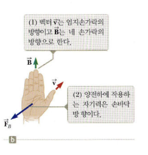
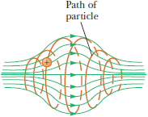
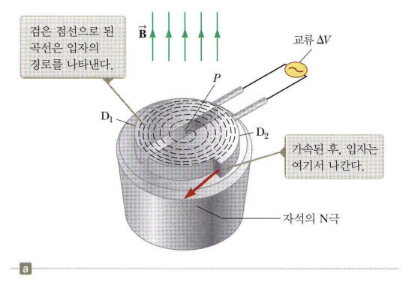
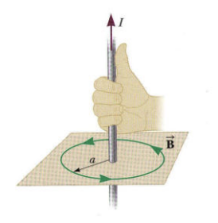

# Sumamry

## 기호 모음

### 상수

- $e = 1.602 \times 10^{-19} \text{C}$ : 전자의 전하량
- $m_p = 1.672 \times 10^{-27} \text{kg}$ : 양성자의 질량
- $\mu_0 = 4\pi \times 10^{-7} \text{T}\cdot\text{m}/\text{A}$ : 자유공간의 자기유도율
- $E$ : 전기장

### 기호

- $q$: 전하량
- $\vec{\bold{v}, v}$: 속도
- $\vec{\bold{\omega}}, \omega$: 각속도
- $\vec{\bold{B}, B}$: 자기장
- $\vec{\bold{F_B}, F_B}$: 자기력
- $\Phi_B$: 자기 플럭스
- $N$: 총 고리 수
- $A$: 면적
- $L$: 길이

## 배경지식

- 전기력 $\vec{\bold{F_E}} = q\vec{\bold{E}}$
- $I = \int \vec{\bold{J}} \cdot d\vec{\bold{A}}$
  - $\vec{\bold{J}}$: 전류 밀도
  - $\vec{\bold{A}}$: 단면적 벡터
- 축전량 $Q = \left|C\varepsilon\right|$
  - $Q$: 전하량
  - $C$: 캐패시턴스
  - $\varepsilon$: 전압(기전력)

## 자기장

<!-- ## 자기장 $\vec{\bold{B}}$

- 움직이는 전하 주위에 생성

## 자기력선

- 자기장의 방향을 나타내는 선
- 단위
  - $T = \dfrac{N}{C\cdot m/s} = \dfrac{N}{A\cdot m}$, 테슬라
  - $G = \text{m}T$

### 자북극과 지자기 북극

- 자북극: 나침반상 북극
- 지자기 북극: 지구를 자석이라 가정했을 때 북극 -->

### 자기력 $\vec{\bold{F_B}}$

- $\vec{\bold{F_B}} = q\vec{\bold{v}} \times \vec{\bold{B}}$
- $F_B = \left|q\right|vB\sin\theta$
- 
- 전하가 자기장에 놓일 때 작용하는 힘

### 등속 원운동상의 자기력

- $F_B = qvB = \dfrac{mv^2}{r}$
  - 반지름 $r = \dfrac{mv}{qB}$
  - 사이클로트론 진동수 $\omega = \dfrac{v}{r} = \dfrac{qB}{m}$
  - 주기 $T = \dfrac{2\pi r}{v} = \dfrac{2\pi}{\omega} = \dfrac{2\pi m}{qB}$

<!-- ## 자기병

- 자기력선이 자기장에 의해 강제로 모이는 현상
-  -->

### 사이클로트론

- 대전 입자 가속기(구식)
- 
- 두 개의 디 사이를 회전
- 탈출 운동 에너지: $E = \dfrac{1}{2}mv^2 = \dfrac{q^2B^2r^2}{2m}$

### 도선상의 자기력

- $\vec{\bold{F_B}} = \left(q\vec{\bold{v}} \times \vec{\bold{B}}\right) \times nAL = I\vec{\bold{L}} \times \vec{\bold{B}} = I\int_a^b d\vec{\bold{s}} \times \vec{\bold{B}}$
- $F_B = ILB$

---

## 자기장의 원천

### 비오-샤바르 법칙

- $d\vec{\bold{B}} = \dfrac{\mu_0}{4\pi} \dfrac{I\left(d\vec{\bold{s}} \times \vec{\bold{r}}\right)}{r^3}$
- $\vec{\bold{B}} = \dfrac{\mu_0}{4\pi} \int \dfrac{I\left(d\vec{\bold{s}} \times \vec{\bold{r}}\right)}{r^3}$
- 전류가 흐르는 도선 주위에 자기장이 생성
  - 직선 도선상의 자기장
    - $B = \dfrac{\mu_0I}{4\pi r}\left(\sin\theta_2 - \sin\theta_1\right)$
    - $\theta_1 = \infty, \theta_2 = -\infty$ 일 때 $B = \dfrac{\mu_0I}{2\pi r}$
  - 원형 도선상의 자기장
    - $B = \dfrac{\mu_0I}{2r}$
- 두 도선 사이의 자기력
  - $F_B = ILB = I_1L\cdot\dfrac{\mu_0I_2}{2\pi r} = \dfrac{\mu_0I_1I_2L}{2\pi r}$

### 앙페르의 법칙

- $\oint \vec{\bold{B}} \cdot d\vec{\bold{s}} = \mu_0 I$
- 도선 내외의 자기장
  - $2\pi_{\text{in}}B_{\text{in}} = \mu_0 I_{\text{in}} = \mu_0\int_0^{r_{\text{in}}} br\,2\pi rdr$
    $\Rightarrow B_{\text{in}} = \dfrac{1}{3}\mu_0 br_{\text{in}}^2$
  - $2\pi_{\text{out}}B_{\text{out}} = \mu_0 I_{\text{out}} = \mu_0\int_0^{r} br\,2\pi rdr$
    $\Rightarrow B_{\text{out}} = \dfrac{1}{3}\dfrac{\mu_0 br^3}{r_{\text{out}}}$

### 솔레노이드

- $B = \dfrac{\mu_0 NI}{l} = \mu_0 nI$
  - $N$: 총 묶음 수
  - $n$: 단위 길이당 묶음 수
  - $l$: 솔레노이드의 길이

---

## 패러데이의 법칙

### 패러데이의 유도법칙

- 유도 기전력 $\varepsilon = -N\dfrac{d\Phi_B}{dt} = -N\dfrac{d}{dt}\int \vec{\bold{B}} \cdot d\vec{\bold{A}}$
  - $N$: 총 고리 수
  - $\Phi_B = \int \vec{\bold{B}} \cdot d\vec{\bold{A}}$: 자기 플럭스
- 운동 기전력 $\varepsilon = -\dfrac{d\Phi_B}{dt} = Blv$
  - $B$: 자기장
  - $l$: 길이
  - $v$: 속도

---

## 전자기파

### 앙페르의 법칙 일반화

- $\oint \vec{\bold{B}} \cdot d\vec{\bold{s}} = \mu_0 I + \mu_0\varepsilon_0\dfrac{d\Phi_E}{dt}$
- 