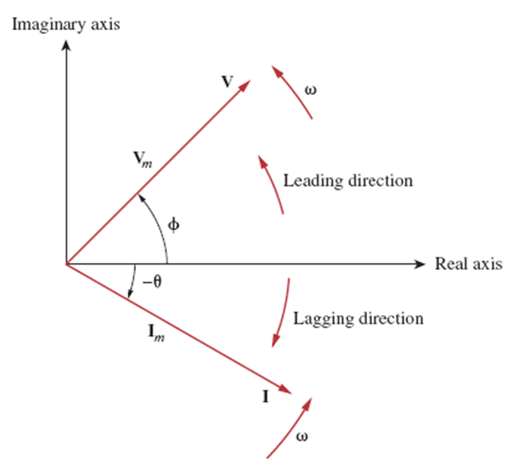
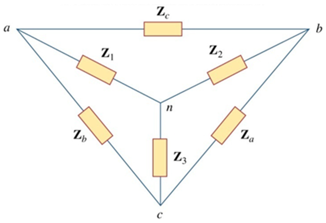

# Summary

하 기 싫 다

## AC forcing function

### 정현파 함수(sinusodial function)

$x\left(t\right) = X_M \cos\left(\omega t + \theta\right)$

- $X_M$ : 진폭 또는 최대값
- $\omega = \dfrac{2\pi}{T} = 2\pi f$ : 각주파수
  - $T$ : 주기
  - $f = \dfrac{1}{T}$ : 진동수
  - $\theta$ : 위상

## 페이저와 복소수

### 복소수(complex number)

복소수 $z$에 대해

- $z = x + jy$ (직교좌표계)
  - $x = r \cos\phi$
  - $y = r \sin\phi$
- $z = r\angle\phi = re^{j\phi}$ (극좌표계)
  - $r = \sqrt{x^2 + y^2}$
  - $\phi = \arctan\dfrac{y}{x}$

켤레복소수(Complex conjugate) 표기는 $\bar{z} \rightarrow z^*$

### 페이저(phasor)

- 벡터의 길이 $\rightarrow$ 진폭
- 벡터의 방향 $\rightarrow$ 위상
- 보통 $t = 0$일 때를 대표적으로 사용
- $V_m\cos\left(\omega t + \phi\right) = V_m\angle\phi$
- $V_m\sin\left(\omega t + \phi\right) = V_m\angle\left(\phi - 90\degree\right)$
- $I_m\cos\left(\omega t + \phi\right) = I_m\angle\phi$
- $I_m\sin\left(\omega t + \phi\right) = I_m\angle\left(\phi - 90\degree\right)$

### 페이저 다이어그램(phasor diagram)

이렇게 생긴것
진동수는 표기 불가
$\therefore$ 페이저 도메인 $=$ 진동수 도메인

### 정현파-페이저 변환(sinusodial-phasor Transformation)

- $\dfrac{dv}{dt} = j\omega V$
- $\int v\,dt = \dfrac{V}{j\omega}$

### 저항에 대한 페이저 위상의 관계

$V=IR$에 의해 전압과 전류는 위상이 같음

- 시간 영역: $v = Ri$
- 진동수 영역: $\bold{V} = R\bold{I}$

### 인덕터에 대한 페이저 위상의 관계

$V=L\dfrac{di}{dt}$에 의해 전압과 전류는 90도 위상차를 가짐 $\left(\phi_V=\phi_I + 90\degree\right)$

- 시간 영역: $v = L\dfrac{di}{dt}$
- 진동수 영역: $\bold{V} = j\omega L\bold{I}$

### 커패시터에 대한 페이저 위상의 관계

$V=\dfrac{1}{C}\int i\,dt$에 의해 전압과 전류는 90도 위상차를 가짐 $\left(\phi_I=\phi_V + 90\degree\right)$

- 시간 영역: $v = C\dfrac{dv}{dt}$
- 진동수 영역: $\bold{V} = \dfrac{\bold{I}}{j\omega C}$

## 임피던스와 어드미턴스

- $V=IR$의 확장형
- $V=IZ$ : $Z$는 임피던스
- $I=GV$ : $G$는 어드미턴스
- $\therefore Z = \dfrac{1}{G}$
- _해당 주파수에서에서만 유효_

### 임피던스(impedance)

- 실수부: 저항
- 허수부: 리액턴스($X$)
  - $X > 0$: 유도성(inductive)
  - $X < 0$: 용량성(capacitive)

### 어드미턴스(admittance)

- 실수부: 컨덕턴스($G$) = $\dfrac{R}{R^2 + X^2}$
- 허수부: 서셉턴스($B$) = $-\dfrac{X}{R^2 + X^2}$

### 저항, 인덕턴스, 커패시턴스의 임피던스 및 어드미턴스

- $R$
  - $Z = R$
  - $G = \dfrac{1}{R}$
- $L$
  - $Z = j\omega L$
  - $G = \dfrac{1}{j\omega L}$
- $C$
  - $Z = \dfrac{1}{j\omega C}$
  - $G = j\omega C$

## 임피던스의 연결

- 단일 주파수 영역에서 임피던스 연산은 일반화
- 저항이랑 똑같다

### 직렬 연결

- $Z_{eq} = \sum Z$
- 전압 분배의 법칙 성립
  - $V = \sum_{i = 1}^{n} \dfrac{Z_i}{\sum Z}V_i$

### 병렬 연결

- $\dfrac{1}{Z_{eq}} = \sum \dfrac{1}{Z}$

### $\Delta$-$Y$ 변환

- $\Delta\rightarrow Y$
  - $Z=\dfrac{양쪽곱}{전부합}$
- $Y\rightarrow\Delta$
  - $Z=\dfrac{복부호동합}{맞은편하나}$
